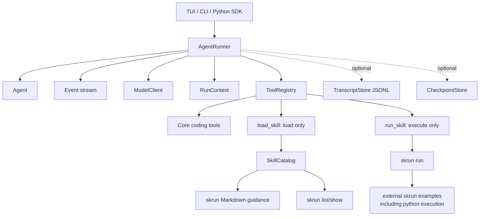

# RestFlow Agent Framework Refactor Plan

## Scope

This plan compares two groups:

- Coding agents: Claude Code, Codex, OpenCode, Gemini CLI.
- Agent frameworks: LangGraph, OpenAI Agents SDK, AutoGen, CrewAI,
  LlamaIndex Workflows, PydanticAI/smolagents-style Python-first agents.

The goal is to turn RestFlow from a broad daemon/workflow product into a
smaller agent framework with:

- a reusable agent runtime
- a small tool system
- file/external skill support
- a TUI client
- Python integration
- optional persistence instead of storage-first architecture

## Common Core Capabilities

Across coding agents and agent frameworks, the recurring core is:

1. Agent definition
   - name
   - instructions/system prompt
   - model/model settings
   - tool set
   - optional handoffs/subagents
   - optional structured output

2. Runner
   - input normalization
   - prompt/context assembly
   - model call
   - tool-call loop
   - streaming events
   - final result
   - cancellation and timeouts

3. Tool system
   - typed schema
   - executor function
   - permission/approval boundary
   - tool result normalization
   - optional tool guardrails

4. Context and memory
   - in-memory turn state
   - transcript/history adapter
   - optional checkpointing
   - optional long-term memory

5. Skills/capabilities
   - file-system or external catalog
   - metadata discovery first
   - full instruction/resource loading on demand
   - executable skill boundary separated from loading

6. Orchestration
   - single-agent run first
   - agent-as-tool or handoff second
   - graph/workflow only when needed

7. Observability
   - structured run events
   - tool spans
   - token/model usage
   - JSONL transcript export
   - traces derived outside `RunEvent`

8. Client surfaces
   - TUI/CLI are clients of the runtime
   - client surfaces should not own durable domain state

## What RestFlow Already Has

RestFlow already has enough pieces to become an agent framework:

- `crates/restflow-ai`
  - `AgentExecutor`
  - `AgentConfig`
  - ReAct-style execution loop
  - LLM clients/factory/switcher
  - context manager and resource limits
  - subagent runtime pieces

- `crates/restflow-tools`
  - `ToolRegistryBuilder`
  - core coding tools: file, patch, edit, grep, glob, bash
  - `load_skill` and `run_skill` direction on the current branch
  - an existing `run_python`/Monty tool that should move out of the core
    framework path and become an external `skrun` example

- `crates/restflow-tui`
  - conversation surface
  - slash-command and skill-picker work in progress

The main issue is not missing primitives. The issue is that the current
product layers mix framework runtime, daemon task runtime, persistence,
marketplace skill mutation, channels, and operational services too
tightly.

## Minimal Product Shape

The smallest useful RestFlow agent framework should look like this:



## Minimal Rust API

Target public framework API:

```rust
let agent = Agent::builder()
    .name("coder")
    .instructions("You are a coding agent.")
    .model("gpt-5.4")
    .tools(Toolset::coding_minimal())
    .build();

let result = AgentRunner::new(agent)
    .with_workspace("/repo")
    .stream("fix the failing test")
    .await?;
```

Core types:

- `Agent`
- `AgentRunner`
- `RunContext`
- `RunEvent` (runtime event only; no embedded trace payload)
- `RunResult`
- `Tool`
- `ToolRegistry`
- `Toolset`
- `SkillCatalog`
- `TranscriptStore`
- `CheckpointStore`

Storage must be represented as optional traits:

- `TranscriptStore`: append/list/get JSONL events.
- `CheckpointStore`: save/load run snapshots.
- `MemoryStore`: optional long-term memory.
- `AgentStore`: optional saved agent profiles.

No framework runtime code should depend directly on redb.

## Minimal Tools to Keep

For a coding-agent framework, keep only:

1. `read_file`
2. `write_file` or `edit`
3. `apply_patch`
4. `grep`
5. `glob`
6. `bash`
7. `load_skill`
8. `run_skill`
9. `spawn_agent` or `agent_as_tool` only after the single-agent path is stable

Do not keep `run_python` in the core minimal toolset. Python execution should be
provided as an external `skrun` example skill so the framework core stays about
agent orchestration, tool calling, and skill boundaries rather than owning every
language runtime.

Defer or move behind optional feature flags:

- email
- Telegram/Discord/Slack
- marketplace
- task scheduling
- durable task/run history
- memory vector search
- provider health projections
- pairing/route binding

## Minimal Storage

For the framework core:

- default: no database
- optional: JSONL transcript store
- optional: checkpoint store
- optional: saved agent profiles

If RestFlow still needs a local app database, keep it outside the framework
crate and adapt it through traits.

Recommended first target:

```text
restflow-agent-framework  # no redb dependency
restflow-tools            # no storage dependency for minimal tools
restflow-skill            # skrun guidance + executable catalog
restflow-python-sdk       # Python creates agents and calls RestFlow runtime
restflow-tui              # client
restflow-daemon           # optional app/server wrapper
```

## Python Integration

Python is primarily a way to create RestFlow agents and call RestFlow runtime
features. It should not mean that the core framework owns a built-in Python
execution tool.

### Python SDK

The `python/` directory currently contains only bytecode cache files, so a real
SDK can be added without fighting existing code.

Target API:

```python
from restflow import Agent, Runner, tool

@tool
def add(a: int, b: int) -> int:
    return a + b

agent = Agent(
    name="math",
    instructions="Use tools when useful.",
    model="gpt-5.4",
    tools=[add],
)

result = Runner.run_sync(agent, "what is 2 + 3?")
print(result.output)
```

Requirements:

- Python can define an `AgentSpec`.
- Python can define local callable tools.
- Python can stream RestFlow run events.
- Python can call built-in RestFlow tools by name.
- Python can call `run_skill` for external executable skills.

### Python execution as an external skrun example

The existing `run_python` + Monty path should move out of the core framework
default and become an example executable skill under the `skrun` boundary.

Example shape:

```text
examples/skrun/python-exec/
  SKILL.md
  run.py
  skill.json
```

Runtime shape:

```text
Agent -> run_skill -> skrun skill run python-exec -> run.py/Monty/sandbox
```

This keeps Python execution available without making it a privileged built-in
framework capability.

Python execution example requirements:

- timeout
- memory/step limits when backend supports them
- workspace restrictions
- approval gate through `run_skill`
- stdout/stderr/exit-code result schema

### Implementation options

1. Python client over local daemon/stdin protocol
   - simplest and safest
   - Rust runtime stays authoritative
   - Python SDK serializes `AgentSpec`, `ToolSpec`, and receives event streams

2. PyO3 bindings around Rust runtime
   - better embedded library feel
   - heavier build/distribution burden

3. Python-native mini runner
   - fastest for Python users
   - risks duplicating Rust behavior

Recommended: start with option 1, then consider PyO3 only after the runtime API
is stable.

## Python SDK Protocol

Minimum protocol:

```json
{
  "type": "run",
  "agent": {
    "name": "coder",
    "instructions": "...",
    "model": "gpt-5.4",
    "tools": ["read_file", "apply_patch", "bash", "load_skill", "run_skill"]
  },
  "input": "fix failing test",
  "workspace": "/repo"
}
```

Events:

```json
{ "type": "run_started", "run_id": "..." }
{ "type": "model_delta", "text": "..." }
{ "type": "tool_call_started", "tool": "grep", "call_id": "..." }
{ "type": "tool_call_finished", "call_id": "...", "output": {...} }
{ "type": "run_finished", "output": "..." }
```

Python local tools can be exposed through a subprocess bridge:

```text
Rust Runner -> Python Tool Host -> Python function -> JSON result
```

This avoids embedding arbitrary Python inside the Rust process.

Generic Python code execution is different from Python-defined tools. Generic
execution belongs in `skrun` examples; Python-defined tools belong in the Python
SDK bridge.

## Refactor Stages

### Stage 1: Define framework boundaries

- Introduce or document `Agent`, `AgentRunner`, `RunContext`, `RunEvent`.
- Keep redb and daemon services out of those types.
- Keep current daemon as an adapter.

### Stage 2: Cut the skill path out of storage

- Runtime catalog becomes `skrun guidance + executable skills`.
- `load_skill` is load-only.
- `run_skill` is execute-only.
- Storage-backed skills become compatibility-only.

### Stage 3: Create minimal toolset

- Build `Toolset::coding_minimal()`.
- Move storage/channel/marketplace tools out of default registry.
- Move `run_python` out of the default registry and into an external `skrun`
  example skill.
- Make dangerous tools go through one approval interface.

### Stage 4: Add transcript adapter

- Add JSONL transcript store as the first persistence adapter.
- Keep database indexes optional and derived.
- Use one event schema for TUI, CLI, Python SDK, and transcript export.

### Stage 5: Add Python SDK

- Add real `python/restflow/*.py` sources.
- Implement `Agent`, `Runner`, `tool`, and event streaming client.
- Let Python call Rust runtime first through a daemon or local subprocess.
- Add a `skrun` Python execution example for users who want generic Python
  code execution as an executable skill.

### Stage 6: Optional multi-agent and workflow layer

- Add `Agent.as_tool()` style delegation.
- Add handoff/subagent policy.
- Add workflow graph only after single-agent + tools + transcript are stable.

## What to Remove or Defer

Remove from the framework core:

- RestFlow-owned skill storage or mutation
- marketplace install/update/delete in primary runtime
- Telegram/Discord/Slack channel runtime
- durable task scheduling
- task/run table-heavy persistence
- memory vector storage
- provider health projection tables
- route/pairing tables
Keep as app-layer optional packages if still needed.

## Acceptance Criteria

RestFlow becomes an agent framework when:

- A user can define an agent in Rust or Python.
- The agent can stream events while running.
- The agent can call typed tools.
- The agent can load skills without storage.
- The agent can run executable skills through `skrun`.
- Python can define agents and local typed tools.
- Generic Python code execution lives outside the framework core as a `skrun`
  example skill.
- Persistence is optional and injected through adapter traits.
- TUI and Python SDK consume the same event stream.
