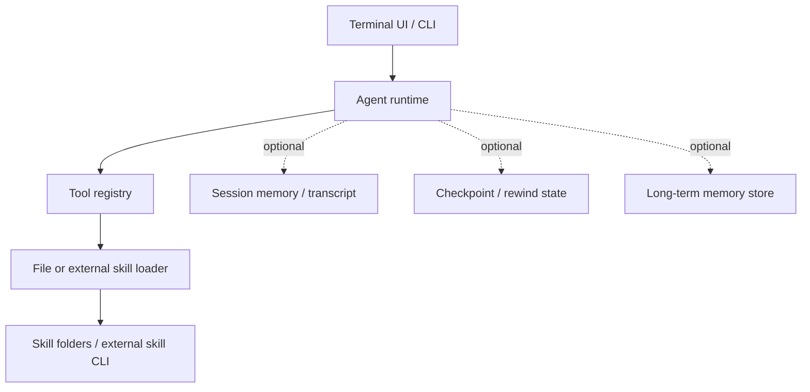
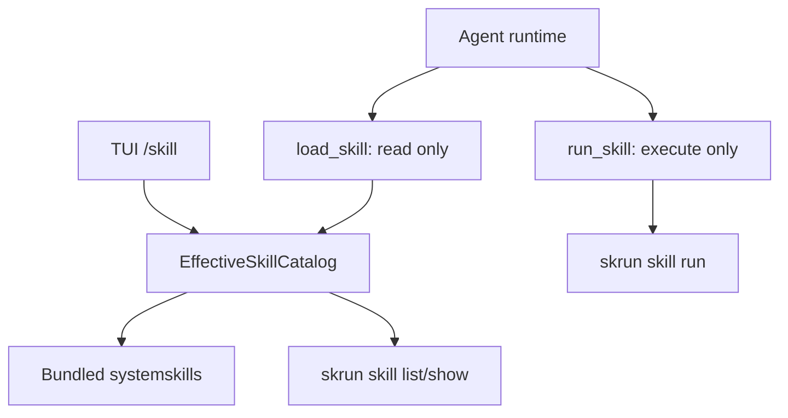
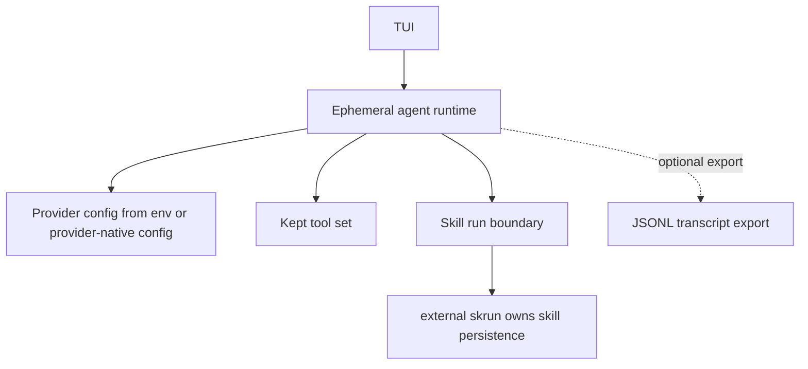

# Agent Framework Storage and Skill Research

## Question

Can the current branch simplify RestFlow toward `agent + skill run + TUI` by
removing the storage layer?

Short answer: yes for the skill path, but not for the whole product unless
RestFlow intentionally becomes an ephemeral terminal agent runner. The reference
products and frameworks mostly treat persistence as one of these narrower
concerns:

- file-based transcript and settings persistence for terminal UX
- optional session memory for multi-turn chat
- checkpoint/state persistence for resumable or human-in-the-loop workflows
- separate long-term memory stores
- file-system or external-tool skill discovery

They do not generally put skill installation, skill activation, chat history,
task runtime, memory, secrets, and tool traces behind one shared storage layer.

## Local CLI Products

| Product | Runtime shape | Persistence shape | Skill/tool shape | Takeaway for RestFlow |
| --- | --- | --- | --- | --- |
| Claude Code local reference | Ink-style terminal app around an agent query loop, tools, commands, skills, and services. | Session logs are JSONL files under the user home project area. Memory is file-based Markdown/YAML under a project memory directory. Small server/session metadata can live in JSON files. | Skills are file-system directories such as `.claude/skills` and can also be built from MCP tools. Plugins/config are file-managed. | Skills are not a DB-first product surface. Transcript/memory persistence is narrow and file-oriented. |
| Codex local reference | Core runtime owns sessions, tools, dynamic tools, skills, MCP, rollouts, and TUI state. | JSONL rollouts are the durable event stream. SQLite state mirrors or indexes rollout metadata, recent threads, dynamic tools, spawn edges, and memory jobs. TUI prompt history is text-only and intentionally separate from rich in-session draft state. | Skills and dynamic tools are runtime concepts, not a mutable workflow-builder database. | If RestFlow needs history/search/resume, prefer transcript/event log plus optional derived index rather than DB-first execution state. |
| OpenCode local reference | Server/TUI/session runtime with explicit session, message, part, todo, permission, project, and snapshot modules. | Uses SQLite via Drizzle for session/message/part/todo/session_entry/permission/project records. Also keeps a file JSON storage service for JSON resources and migration compatibility. | Skills are discovered from `~/.claude`, `~/.agents`, project external dirs, configured skill paths, URLs, and cached remote indexes. The `skill` tool loads skill content and sampled files. | OpenCode keeps durable session storage, but skill discovery is file/external-source based rather than a primary mutable skill table. |
| Gemini CLI local reference | Core agent session plus CLI/TUI surfaces, tools, memory, skills, checkpoint, rewind, session browser, and settings. | Sessions are JSON files under `~/.gemini/tmp/<project_id>/chats`. Checkpoints use a shadow Git repo under `~/.gemini/history/<project_id>` plus JSON checkpoint metadata. Settings, memory, commands, skills, policies, and shell history are file paths under `.gemini` or `.agents`. | Skills are discovered from workspace/user/extension directories. Only skill metadata is loaded initially; `activate_skill` loads the body/resources into context and adds the skill directory to workspace context after confirmation. | Gemini is the clearest precedent for `agent + TUI + file skills + optional checkpoints`, with no central application DB required for the skill path. |

## Frameworks

| Framework | Persistence model | Relevance |
| --- | --- | --- |
| LangGraph | Graph state persistence is checkpoint-based and organized by `thread_id`. Checkpointers are pluggable; memory across threads uses a separate store interface. In-memory is for development; SQLite/Postgres/Redis/Mongo-style backends are optional depending on durability needs. | Persistence belongs to the resumable graph execution boundary, not to all product concepts. |
| LlamaIndex Workflows | Workflows are ephemeral by default. For cross-run state, callers pass a `Context`; the context can be serialized with `to_dict` and restored with `from_dict`. For crash recovery, steps can snapshot context into an external database such as Redis. | The default is no persistence; durability is added only where the workflow requires it. |
| OpenAI Agents SDK | Sessions are optional client-side memory for conversation history across runs. Built-in session backends include in-memory/file SQLite, Redis, SQLAlchemy, Dapr, OpenAI-hosted conversation sessions, and encrypted wrappers. | Session memory is a replaceable adapter passed to the runner, not a global storage dependency. |
| AutoGen | Agents and teams expose explicit `save_state()` and `load_state()` APIs. Teams save the state of their member agents. Custom agents can override state behavior. | Durable state is explicit and serializable at agent/team boundaries. |
| CrewAI | Memory is a unified optional capability that can be used standalone, with crews, with agents, or with flows. Default storage is LanceDB under `./.crewai/memory` or `CREWAI_STORAGE_DIR`; custom backends are possible. | Long-term memory is a separate memory subsystem, not the agent loop itself. |

## Pattern Synthesis

The common pattern is:

The important separation is:

- `Agent runtime`: prompt assembly, model calls, tool loop, streaming, safety.
- `Skill loader`: discovers and loads procedural instructions/resources.
- `Skill runner`: executes external skill code or workflows when explicitly
  invoked.
- `Session memory`: remembers conversation history if the product needs resume.
- `Checkpoint`: restores execution/file state if the product needs rewind,
  human-in-the-loop, or crash recovery.
- `Long-term memory`: recalls facts across conversations.

These are separate adapters. Removing one should not require deleting the others.

## RestFlow Implications

### Remove storage from the skill path

This is strongly supported by the references.

Target:

Rules:

- `load_skill` lists and reads only.
- `run_skill` executes only.
- RestFlow does not create, install, update, delete, import, export, or store
  skills in the primary runtime path.
- Legacy storage-backed skills become compatibility-only data until a migration
  or removal decision is made.

### Do not remove all storage unless product scope changes

If RestFlow keeps daemon-backed tasks, resumable sessions, scheduled runs,
memory, secrets, trace inspection, or browser/task history, then a storage
boundary still has a job. The problem is not "storage exists"; the problem is
that storage is currently too close to the skill/runtime surface.

If the product intentionally becomes only `agent + skill run + TUI`, the storage
free shape is viable:

This gives up:

- saved sessions and resume browser
- durable Task / Run scheduling and history
- redb-backed trace/query inspection
- RestFlow-managed secrets/auth profiles
- RestFlow-managed memory
- daemon-backed browser/workspace run tree

## Recommended Direction

1. Keep the current branch focused on removing storage from the skill runtime
   path, not from all of RestFlow.
2. Make the runtime-visible skill catalog exactly `systemskills + skrun`, with
   deterministic shadowing and no storage-backed model-visible tools.
3. Keep `/skill` view-only in the TUI.
4. Keep `skrun` as the install/catalog/run owner for executable skills.
5. If resume/history is still desired, use a transcript/event-log adapter first.
   Add SQLite/redb only as a derived query/index layer, following the Codex-style
   separation.
6. If the product decision is full `agent + skill run + TUI`, create a separate
   storage-free branch and explicitly remove or hide daemon/task/run/memory/auth
   surfaces as product scope cuts.

## Decision Matrix

| Decision | Recommended now | Why |
| --- | --- | --- |
| Remove `restflow-storage` from skill catalog/runtime tool assembly | Yes | Matches Claude/Gemini/OpenCode skill discovery patterns. |
| Remove legacy skill mutation from primary CLI/TUI | Yes | Avoids RestFlow becoming a second skill package manager beside `skrun`. |
| Remove storage from session/task/run daemon paths | No, unless scope changes | Those features require durable state by definition. |
| Replace all storage with in-memory state | Only for an explicit ephemeral TUI product | This deletes resume, scheduling, memory, traces, and managed auth behavior. |
| Use JSONL transcripts before DB indexes | Yes if keeping history | Matches Codex/Gemini-style simpler durability. |

## Source Notes

Local references inspected:

- `/Volumes/samsung/GitHub/claude-code-source-main/README_ARCHITECTURE.md`
- `/Volumes/samsung/GitHub/claude-code-source-main/src/memdir/README.md`
- `/Volumes/samsung/GitHub/claude-code-source-main/src/skills/README.md`
- `/Volumes/samsung/GitHub/codex/codex-rs/state/src/lib.rs`
- `/Volumes/samsung/GitHub/codex/docs/tui-chat-composer.md`
- `/Volumes/samsung/GitHub/opencode/packages/opencode/src/storage/`
- `/Volumes/samsung/GitHub/opencode/packages/opencode/src/session/`
- `/Volumes/samsung/GitHub/opencode/packages/opencode/src/skill/`
- `/Volumes/samsung/GitHub/gemini-cli/docs/cli/session-management.md`
- `/Volumes/samsung/GitHub/gemini-cli/docs/cli/checkpointing.md`
- `/Volumes/samsung/GitHub/gemini-cli/docs/cli/skills.md`
- `/Volumes/samsung/GitHub/gemini-cli/packages/core/src/config/storage.ts`
- `/Volumes/samsung/GitHub/gemini-cli/packages/core/src/services/chatRecordingService.ts`

External references:

- https://docs.langchain.com/oss/python/langgraph/persistence
- https://developers.llamaindex.ai/python/llamaagents/workflows/managing_state/
- https://developers.llamaindex.ai/python/llamaagents/workflows/durable_workflows/
- https://openai.github.io/openai-agents-python/sessions/
- https://microsoft.github.io/autogen/dev/user-guide/agentchat-user-guide/tutorial/state.html
- https://docs.crewai.com/en/concepts/memory
