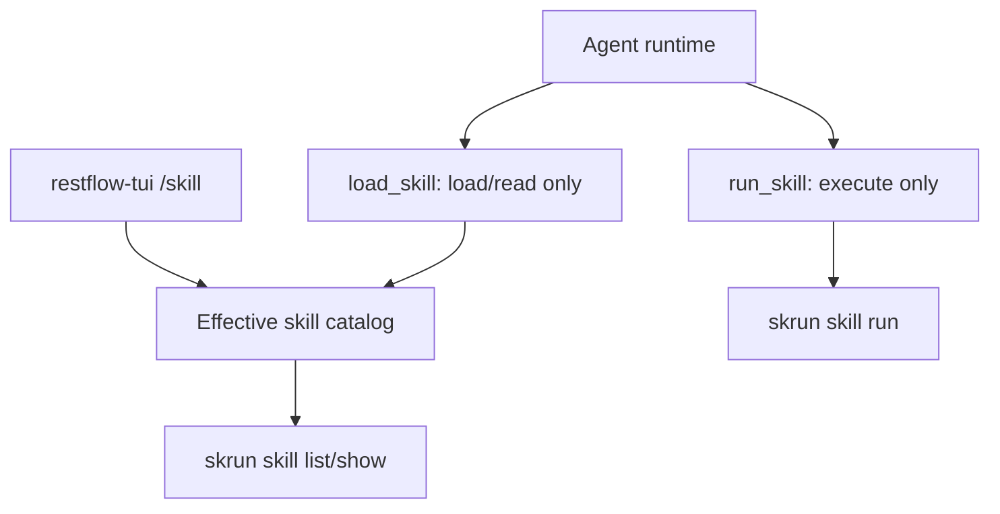
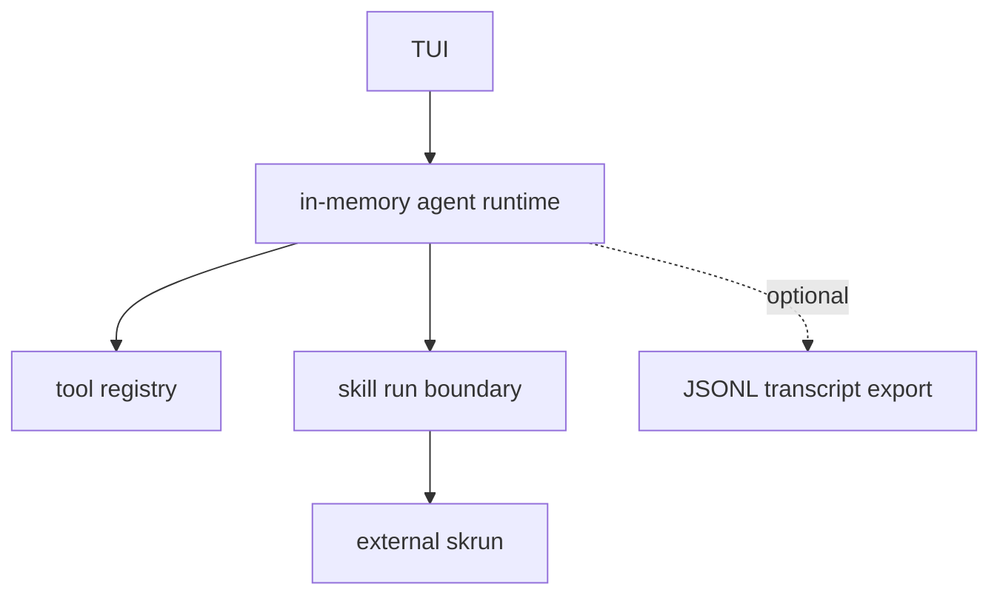

# Local CLI Code Research: Skills, Runtime, TUI, and Persistence

## Scope

This note is based on local source code only:

- Claude Code: `/Volumes/samsung/GitHub/claude-code-source-main`
- Codex: `/Volumes/samsung/GitHub/codex`
- OpenCode: `/Volumes/samsung/GitHub/opencode`
- Gemini CLI: `/Volumes/samsung/GitHub/gemini-cli`

The question is whether RestFlow can simplify toward `agent + skill run + TUI`
and remove storage from the skill path, or remove storage entirely.

## High-Level Comparison

| Product | Agent runtime | TUI / CLI role | Skill model | Persistence model |
| --- | --- | --- | --- | --- |
| Claude Code | In-memory query loop that streams assistant/tool events through an async generator. | Terminal UI consumes query output, command expansion, tool events, and prompt history. | File-system skill directories plus MCP-derived prompt skills. `SkillTool` either expands prompt instructions or forks a sub-agent. | JSONL transcripts under the Claude config home project area, separate prompt history JSONL, file-based memory directory. |
| Codex | Central Rust runtime orchestrator with in-memory `SessionState`, tools, skills, MCP, hooks, rollout recording, and plugins. | TUI is a client of core protocol events; it has skill list/manage UI helpers but does not own runtime persistence. | Embedded system skills installed into `CODEX_HOME/skills/.system`; user skills are runtime-discovered and can be enabled/disabled. | JSONL rollout files are the durable source; SQLite state is a small mirror/index over rollout metadata, not the execution source of truth. |
| OpenCode | Server-side session processor streams LLM/tool events into session/message/part records. | TUI app is a client over SDK/server events and local contexts. | Skills are discovered from file dirs, configured paths, URLs, and cached indexes. `skill` tool loads skill content only. | SQLite app DB for sessions/messages/parts/todos/permissions/projects, plus JSON file storage for auxiliary resources. |
| Gemini CLI | Agent protocol/session wrapper exposes events as async streams. Tool registry is an in-memory map plus discovered command/MCP tools. | CLI/TUI consumes events, chat recording, checkpointing, and storage paths. | Skill manager discovers built-in, extension, user, and workspace skill dirs; `activate_skill` loads full instructions/resources into context. | Chat JSON files, checkpoint JSON files, shadow Git snapshots, file-based settings/memory/history/skills. No central DB for skills. |

## Claude Code

### Runtime

- `src/query.ts` owns the main query loop. `QueryParams` carries messages,
  prompts, user/system context, tool-use context, turn limits, and task budget.
- The loop keeps mutable in-memory state for message id, fork numbers,
  token-usage tracking, tool-use limits, and per-query working state.
- Runtime persistence is not injected as a primary storage layer. The query loop
  records transcript items through session storage helpers while continuing to
  run as an in-memory async generator.

### Transcript and History

- `src/utils/sessionStorage.ts` writes transcripts as JSONL files below the
  Claude config home `projects` directory.
- Transcript paths are project/session based. Sub-agent transcripts live under
  the parent session path with a separate `subagents` directory and metadata
  sidecar files.
- The transcript recorder filters out ephemeral progress and some internal
  chain-participant events instead of treating every UI event as persisted
  session state.
- `src/history.ts` keeps prompt history in a separate `history.jsonl` file and
  orders the current session's entries ahead of older project entries.

### Skills

- `src/skills/loadSkillsDir.ts` loads skill directories shaped as
  `skill-name/SKILL.md`; it also supports legacy command directories.
- Skill frontmatter provides metadata such as display name, description,
  allowed tools, model, user-invocable behavior, hooks, context, agent, effort,
  and shell snippets.
- `src/tools/SkillTool/SkillTool.ts` exposes the model-visible skill execution
  tool. It validates the requested skill, applies permission rules, records
  usage, and either expands a prompt skill inline or runs it in a forked
  sub-agent.
- Skills are file and MCP prompt artifacts. They are not stored in a primary
  application database.

### Memory

- `src/memdir/memdir.ts` uses a file-based memory directory with `MEMORY.md` as
  the entrypoint.
- The memory implementation explicitly separates persistent project memory from
  task planning or generic session persistence.

## Codex

### Runtime

- `codex-rs/core/src/codex.rs` is the central runtime orchestrator. It pulls
  together session handling, tools, dynamic tools, skills, MCP, hooks, plugins,
  compaction, memory, rollout recording, and sub-agent style work.
- `codex-rs/core/src/state/session.rs` holds `SessionState`, an in-memory
  session-scoped state object with conversation history, configuration, rate
  limits, dependency environment, connector selection, and granted
  permissions.

### Rollouts and Indexing

- `codex-rs/rollout/src/recorder.rs` records response items to JSONL rollout
  files and flushes them to disk.
- Rollout discovery is filesystem-first. SQLite state is used as an index and
  fallback/warm-up mechanism, but the rollout JSONL remains the durable source
  for session content.
- `codex-rs/state/src/lib.rs` describes the SQLite layer as intentionally small:
  it extracts rollout metadata and mirrors it into a local DB for query/listing
  paths.
- `codex-rs/state/src/runtime/threads.rs` stores thread metadata, dynamic
  tools, spawn edges, and rollout lookup metadata. This is derived state around
  the rollout stream, not a DB-first runtime.

### TUI

- `codex-rs/tui/src/session_log.rs` has an optional TUI session event log
  controlled by environment variables. It is a debugging/recording aid, not the
  primary runtime store.
- `codex-rs/tui/src/skills_helpers.rs` and
  `codex-rs/tui/src/chatwidget/skills.rs` implement skill display, fuzzy
  matching, list/manage UI, and enable/disable behavior.

### Skills

- `codex-rs/skills/src/lib.rs` embeds system skills into the binary and
  installs them under `CODEX_HOME/skills/.system` with marker/fingerprint
  checks.
- TUI skill operations list, enable, and disable discovered skills. Skills are
  presented to the runtime as discovered file/system artifacts rather than
  mutable database rows.

## OpenCode

### Runtime

- `packages/opencode/src/session/processor.ts` owns the session stream
  processor. It receives LLM stream events, creates pending/running tool parts,
  writes reasoning/text/tool deltas, updates status, and emits bus events.
- This processor is deliberately service-oriented: it depends on session,
  config, bus, snapshot, agent, LLM, permission, plugin, summary, and status
  services.

### Storage

- `packages/opencode/src/session/session.sql.ts` defines SQLite tables for
  sessions, messages, parts, todos, session entries, and permissions.
- `packages/opencode/src/storage/db.ts` opens the Drizzle SQLite database at
  `Global.Path.data/opencode.db`, applies migrations, and provides transaction
  helpers.
- `packages/opencode/src/storage/storage.ts` provides JSON file storage under
  `Global.Path.data/storage` for auxiliary resources and compatibility paths.

### Tools and Skills

- `packages/opencode/src/tool/registry.ts` builds the runtime tool registry.
  It assembles builtin tools, plugin/custom tools, provider/LSP-backed tools,
  and the `skill` tool. It also exposes skill metadata to the model by calling
  `Skill.available(agent)` and formatting the available skills.
- `packages/opencode/src/skill/index.ts` discovers skills from external dirs
  such as `.claude` and `.agents`, configured paths, URLs, and cache indexes.
  The skill service keeps discovered skills in instance state, not in the
  session database.
- `packages/opencode/src/tool/skill.ts` is a load-only skill tool. It returns
  skill content and sampled files after permission handling; it does not mutate
  or execute a database-backed skill record.

### TUI

- `packages/opencode/src/cli/cmd/tui/app.tsx` creates an OpenTUI/Solid app that
  consumes server URL/fetch/header/event contexts, SDK context, local context,
  keybindings, prompt history, and config.
- The TUI is a client surface over the server/session layer. It is not the
  owner of session storage or skill discovery.

## Gemini CLI

### Runtime

- `packages/core/src/agent/agent-session.ts` wraps an `AgentProtocol` and turns
  sends/subscriptions into async event streams. It can replay events from an
  event id or stream id and stops at `agent_end`.
- `packages/core/src/tools/tool-registry.ts` keeps tools in an in-memory
  `Map`. It registers builtin tools, discovered command tools, and MCP tools,
  filters active tools by policy/config, and returns function declarations for
  the model.

### Storage and Checkpoints

- `packages/core/src/config/storage.ts` centralizes file paths for global
  settings, user skills, user `.agents` skills, memory files, project temp
  dirs, chat files, checkpoints, plans, tracker files, task files, and shell
  history.
- `packages/core/src/services/chatRecordingService.ts` records conversations
  as JSON files under the project temp chat directory. It records messages,
  thoughts, token counts, and tool call records.
- `packages/core/src/utils/checkpointUtils.ts` creates checkpoint JSON around
  restorable tool calls and uses Git service snapshots for file rollback.
- `packages/core/src/utils/sessionOperations.ts` deletes per-session logs, tool
  outputs, top-level session artifacts, and sub-agent artifact directories.

### Skills

- `packages/core/src/skills/skillManager.ts` discovers built-in, extension,
  user, user `.agents`, workspace, and workspace `.agents` skills. It keeps an
  in-memory list and active skill set.
- `packages/core/src/tools/activate-skill.ts` validates and optionally confirms
  skill activation. On execution, it activates the skill, adds the skill
  directory to workspace context, and returns the full skill instructions plus
  available resource tree.
- Gemini's skill path is file-first and activation-based. The DB-free design is
  explicit: only metadata is cheap to discover, and full content/resources are
  loaded when a skill is activated.

## Cross-Product Patterns

1. Skills are not DB-first
   - Claude Code, Codex, OpenCode, and Gemini CLI all treat skills as files,
     embedded resources, MCP prompts, URLs, plugin artifacts, or external
     command/catalog outputs.
   - Even OpenCode, which has the strongest SQLite product database, keeps
     skills outside the DB and exposes them through a load-only tool.

2. Runtime state is mostly in memory
   - Claude Code and Gemini CLI expose async event streams around in-memory
     runtime state.
   - Codex keeps `SessionState` in memory and records JSONL rollouts.
   - OpenCode writes session parts into SQLite as the stream progresses because
     its product is server/session oriented.

3. Persistence is narrow and explicit
   - Claude Code persists JSONL transcripts, prompt history, and file memory.
   - Codex persists JSONL rollouts and mirrors metadata into SQLite.
   - Gemini persists chat JSON, checkpoints, shadow Git snapshots, and file
     settings/memory.
   - OpenCode persists session/message/part records in SQLite but still keeps
     skill discovery separate.

4. TUI does not own durable state
   - The TUI is a view/controller over the runtime and protocol.
   - Optional TUI logs exist for debugging or replay, but not as the core
     domain model.

## RestFlow Recommendation

### Remove storage from skill catalog and skill execution now

This is strongly supported by all four local products.

Target shape:

Concrete rules:

- `load_skill` lists and reads skill instructions/resources only.
- `run_skill` runs executable skills through the external `skrun` boundary.
- RestFlow should not create, update, delete, import, export, or install
  runtime-visible skills in the primary TUI/agent path.
- RestFlow storage should not keep a compatibility skill catalog; any old data
  migration should live outside the runtime path.

### Do not remove all storage unless the product scope is intentionally cut

Removing all storage is viable only if RestFlow becomes an ephemeral terminal
agent runner:

This would intentionally remove or hide:

- durable Task / Run scheduling and history
- saved sessions and resume browser
- redb-backed trace/query inspection
- RestFlow-managed secrets/auth profiles
- RestFlow-managed memory
- browser/workspace run tree history

If those product surfaces remain in scope, storage should stay behind those
boundaries, but it should not be required for skill discovery, skill activation,
or model-visible skill tools.

## Implementation Guidance for the Current Branch

1. Keep the branch focused on skill-path simplification, not full storage
   deletion.
2. Make `skrun` the only runtime-visible skill catalog.
3. Keep `/skill` in TUI as a view/read/detail surface.
4. Keep `skrun` as the owner of installation, catalog persistence, and
   executable skill runs.
5. If RestFlow needs resumable conversation history later, prefer a JSONL
   transcript/event stream first and add redb/SQLite only as a derived query
   index.
