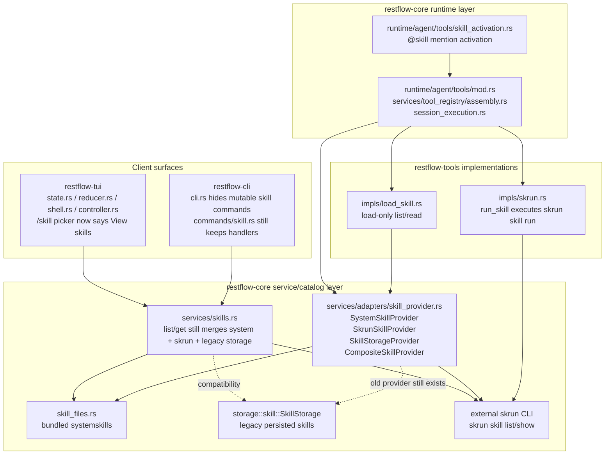
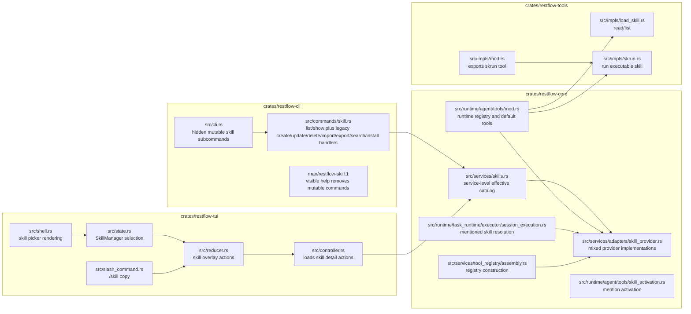
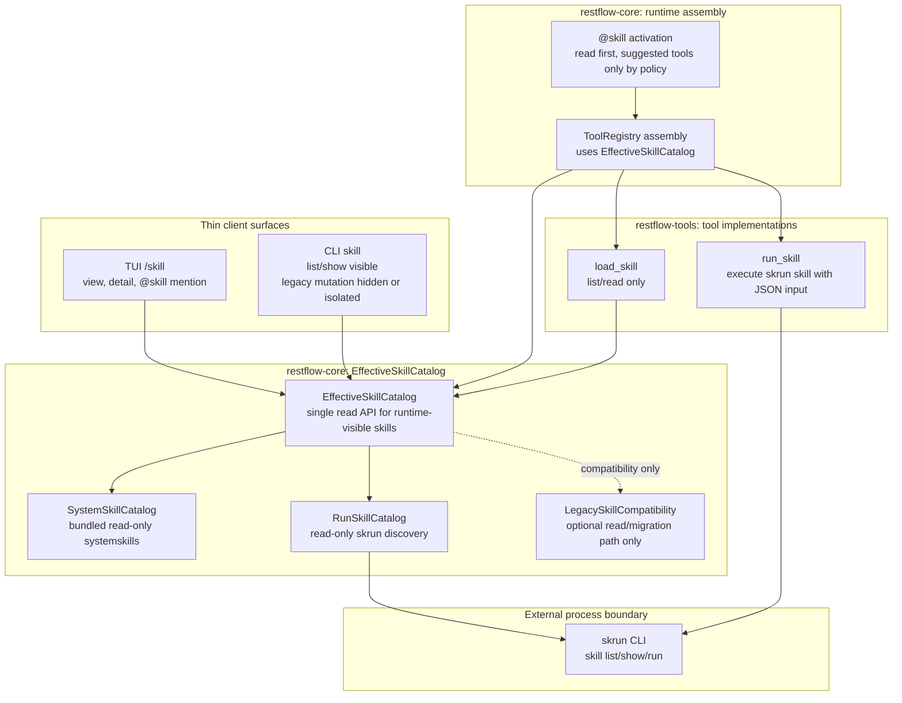
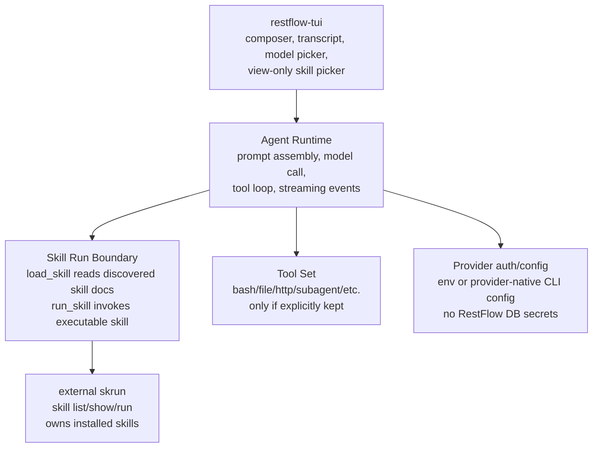
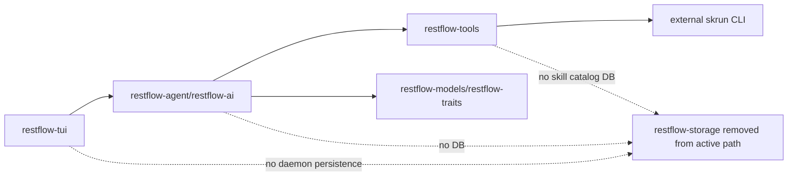
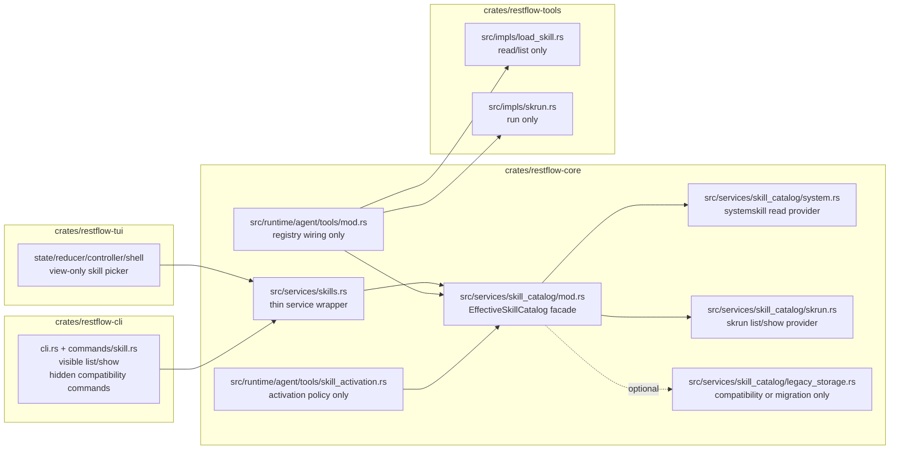
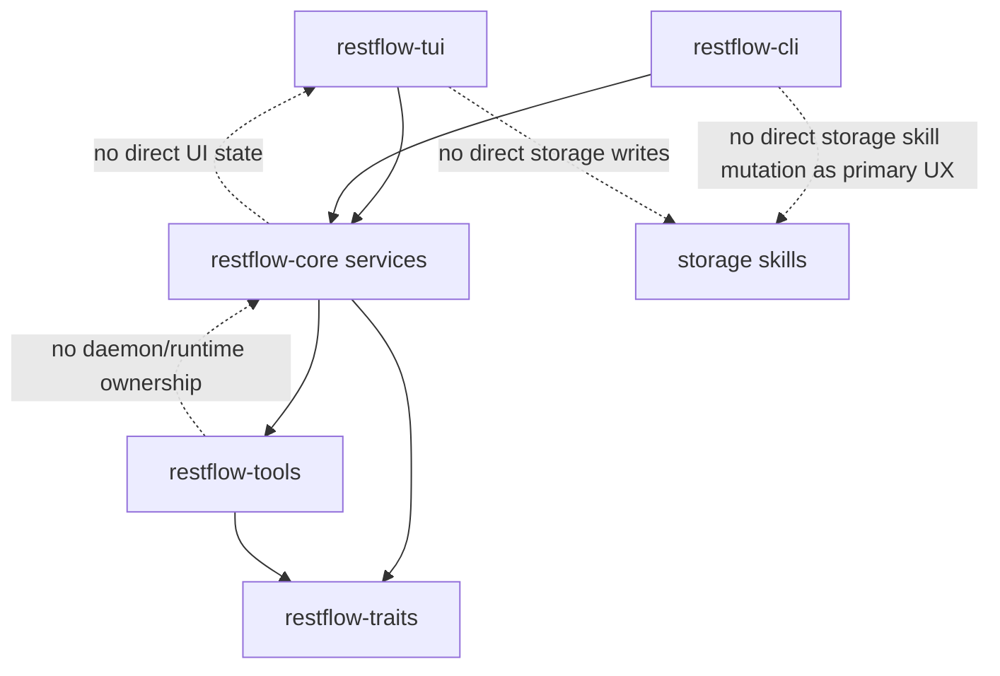

# Current Branch Simplification Diagrams

## Current Branch Graph

This is the current shape of the `codex/tui-system-simplification` branch. The
branch is already moving toward a read-only skill surface, but the files still
mix three concepts:

- bundled systemskills
- executable skills discovered through `skrun`
- legacy storage-backed user skills and mutation commands

## Current File Architecture

## Target Simplified Graph

The simplified graph should have one catalog boundary and one execution
boundary. TUI and CLI only view or request through the daemon/core layer.

## More Aggressive Storage-Free Target

If the product goal is to simplify RestFlow into only `agent + skill run + TUI`,
then the target graph is smaller than the daemon-centric architecture. In this
shape, RestFlow becomes an ephemeral terminal agent runner. `skrun` owns skill
installation/catalog/execution, and RestFlow does not own durable sessions,
tasks, runs, secrets, memory, or skill storage.

In this model, the dependency shape becomes:

What disappears from active product scope:

- saved chat sessions and resume history
- durable Task / Run scheduling and history
- redb-backed tool traces and execution inspection
- RestFlow-managed secrets and auth profiles
- RestFlow-managed skill create/update/delete/import/install
- memory storage

What remains:

- TUI conversation surface
- one in-memory agent execution loop
- model selection/auth through environment or provider-native config
- `load_skill` as a read-only view over `skrun skill list/show`
- `run_skill` as the executable skill runner
- optional non-persistent tool execution

## Target File Architecture

This is the target shape to simplify toward. It can be reached incrementally;
the important part is to isolate catalog ownership from runtime tool execution.

## Dependency Rules After Simplification

Required invariants:

- `restflow-tui` and `restflow-cli` remain client surfaces.
- `restflow-core` owns catalog composition and runtime assembly.
- `restflow-tools` owns `load_skill` and `run_skill` behavior only.
- Legacy storage-backed skills do not become model-visible tool names.
- `skrun` is an external process boundary, not daemon-owned persistence.

For the aggressive storage-free target, replace those invariants with:

- `restflow-tui` calls an in-process or lightweight agent runtime.
- The agent runtime is ephemeral unless the user explicitly exports output.
- `skrun` owns skill persistence and executable skill lifecycle.
- RestFlow does not create, install, store, or mutate skills.
- RestFlow does not promise resume/history/task/run inspection.

## Simplification Moves

1. Rename the current mixed `skill_provider.rs` conceptually into a catalog
   boundary, then split it only if the file keeps growing.
2. Keep `services/skills.rs` as the API wrapper, not the place where every
   catalog source is manually merged.
3. Keep mutable skill CLI handlers hidden and mark them as compatibility until a
   cleanup/migration branch removes or replaces them.
4. Keep TUI `/skill` view-only unless a separate product decision reintroduces
   install or edit flows.
5. Keep `load_skill` and `run_skill` separate: reading a skill is not running a
   skill.

## Storage-Free Migration Moves

If we choose the aggressive `agent + skill run + TUI` direction, the migration
should be explicit:

1. First remove storage from the skill path only.
   - `load_skill` reads systemskill/skrun catalog only.
   - `run_skill` executes through `skrun`.
   - Hidden legacy skill mutation commands remain temporarily but are no longer
     part of the runtime path.

2. Then decide whether RestFlow still has daemon/session/task ambitions.
   - If yes, keep storage for sessions/tasks and stop at the target simplified
     graph above.
   - If no, delete or isolate task/run/session/memory/auth surfaces behind a
     separate legacy feature or branch.

3. Finally collapse the active architecture to:
   - `restflow-tui`
   - agent runtime
   - `restflow-tools`
   - external `skrun`

This is a product cut, not only a code refactor.
