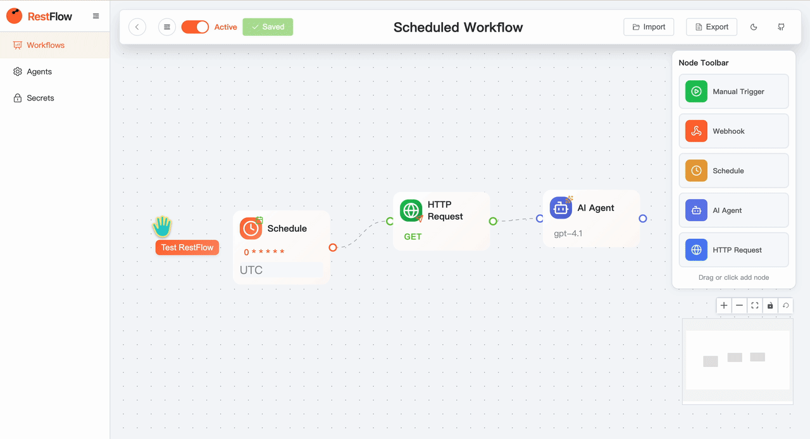

<div align="center">
  

  # RestFlow

  **🦀 RestFlow works for you**

  Visual workflow automation powered by Rust & AI agents

  [](https://restflow.ai)
  [](https://docs.restflow.ai/)
  [](https://github.com/lhwzds/restflow)
  [](https://www.rust-lang.org/)
  [](https://vuejs.org/)

</div>

> ⚠️ **Early Development** - This project is in active development. APIs and features may change.

---

## Workflow Execution



## Quick Start

### Try the Demo

**[restflow.ai](https://restflow.ai)** - Live demo deployed on Vercel

### Start with docker

```bash
docker compose up -d --build
```

Access at http://localhost:3000

## Documentation

**[docs.restflow.ai](https://docs.restflow.ai/)** - Full documentation
