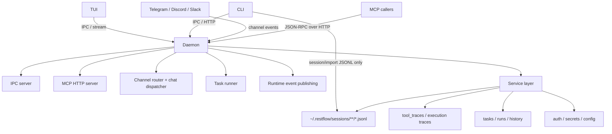
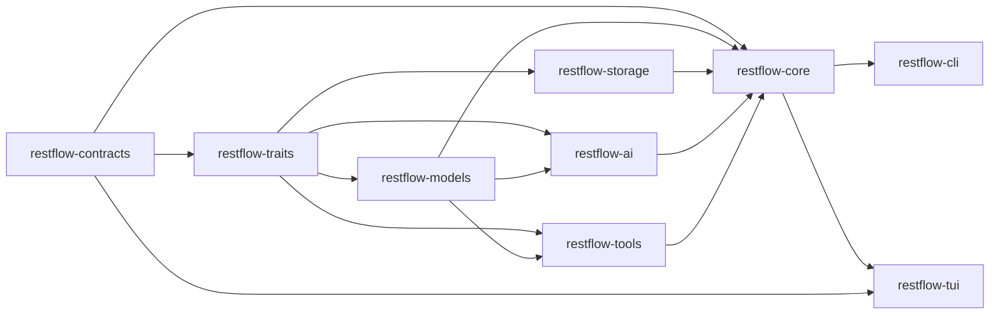
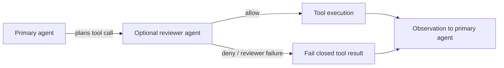
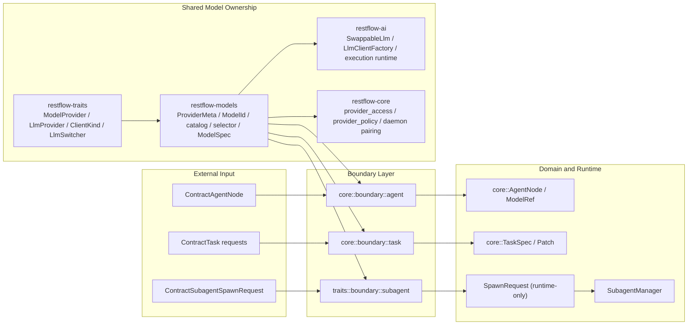

# RestFlow System Architecture

## Status

- Updated: 2026-05-03
- Scope: Runtime architecture, session storage, deployment model, and migration baseline
- Audience: Core contributors working on TUI, CLI, daemon, skills, and runtime channels

## 1. Architectural Decision

RestFlow follows a **local agent runtime with file-backed sessions** architecture.

- Daemon is the execution owner for agent loops, tasks, channels, approvals, secrets, and runtime side effects.
- User-visible chat sessions are stored as one JSONL file per session under `~/.restflow/sessions/`.
- TUI reads session history through daemon IPC; `SessionService` is the canonical user-visible session read/write boundary and prefers JSONL when the file store is available.
- CLI `session` commands route through daemon IPC and `SessionService`; `import` may write JSONL session transcripts directly because it only migrates external history.
- `restflow.db` remains a legacy daemon state store during reduction; it is not the canonical source for user-visible chat sessions.

This keeps execution ownership centralized while making session history portable,
inspectable, and compatible with other coding-agent transcripts.

## 2. System Invariants

1. Single execution center: agent execution and routing decisions are daemon-owned.
2. Canonical session files: user-visible session history lives in JSONL files under `~/.restflow/sessions/`.
3. Direct session-file writes outside `SessionService` are limited to transcript import.
4. Daemon-owned state remains daemon-owned: tasks, runs, channels, approvals, secrets, and runtime side effects must not be written by TUI adapters.
5. One file per session: imported Claude Code, Codex, and OpenCode histories are normalized into RestFlow session JSONL, without preserving source-specific storage ownership fields.
6. Single approval replay field: `approval_id` is the only canonical replay contract field. Any legacy `confirmation_token` compatibility is ingress-only and must not appear in typed contracts or outputs.

## 3. Runtime Topology

### 3.1 Runtime Dependency Graph



### 3.2 Crate Dependency Graph



Notes:

- `restflow-tools` only depends on `restflow-ai` in `dev-dependencies`; there is no production `tools -> ai` dependency.
- Browser automation is no longer a core crate or daemon tool. Use an external
  skrun skill when browser automation is required.

## 4. Main Execution Flows

### 4.1 Chat Session Flow

1. Client sends request to daemon.
2. Daemon routes message via channel runtime.
3. Runtime executes agent/tool loop.
4. Daemon emits realtime events and appends normalized transcript events.
5. Client renders stream and later reads history from `~/.restflow/sessions/**/*.jsonl`.

### 4.2 Session Import Flow

1. CLI reads local source history:
   - Claude Code: `~/.claude/projects/**/*.jsonl`
   - Codex: `~/.codex/sessions/**/rollout-*.jsonl`
   - OpenCode: `~/.local/share/opencode/opencode.db`, XDG data dir, or legacy JSON storage
2. Source adapters extract stable fields: id, title, cwd, timestamps, model, provider, messages, reasoning, tool calls, tool results, compaction summaries, and usage.
3. RestFlow writes one normalized JSONL file per imported session.
4. Source-specific ownership fields are not preserved as RestFlow session state.

### 4.3 Task / Run Flow

1. Task is scheduled/triggered in daemon.
2. Runner executes task in daemon runtime.
3. Messages/events are published once with stable IDs.
4. Task history and message history are persisted by daemon only.

### 4.4 Tool Trace Flow

1. Runtime emits turn/tool events during execution.
2. `tool_traces` persists execution traces.
3. Session execution steps are backfilled from traces for persisted UI rendering.

## 5. Component Responsibilities

### TUI

- Primary local user interface.
- Calls daemon/runtime through IPC and stream contracts.
- Reads session history through daemon IPC; daemon services own JSONL transcript access.
- Does not write task/run/channel/secrets state.

### CLI

- Command interface and user-facing formatting.
- Uses daemon as primary runtime endpoint.
- Does not duplicate core runtime behavior.
- Owns transcript-only file commands: `session` and `import`.

### Daemon/Core Runtime

- Owns chat routing, task execution, and event emission.
- Owns all persistence updates.
- Owns channel/session binding and policy enforcement.

### Execution Ownership Split

- `restflow-ai` owns the agent loop, LLM runtime, and subagent execution runtime.
- `restflow-core` owns the daemon, durable background/task runtime, and client-facing execution services.
- `restflow-core::runtime::subagent` is adapter-only and must stay limited to definition lookup and storage-backed registry wiring.
- `restflow-tools` owns tool implementations and template/payload adapters, not daemon runtime ownership.
- Team-style coordination is guidance from the `team` skrun skill executed through `spawn_subagent_batch`; Task/Run history remains the only durable execution state.

### Auxiliary Reviewer Agent Gate

The primary agent loop may be configured with an auxiliary tool-call reviewer
inside the same session execution. This is a runtime gate in `restflow-ai`, not a
new storage owner.



Invariants:

- The reviewer receives the current session transcript snapshot plus the exact planned tool call.
- Tool arguments are reviewed after runtime context injection, such as parent run and trace IDs.
- Reviewer denial or reviewer failure prevents the tool from executing.
- The reviewer is an auxiliary decision point only; it does not write storage,
  mutate task/run state, or own daemon runtime behavior.

### Model and Provider Ownership

Provider/model ownership is intentionally split from daemon runtime ownership:

- `restflow-traits` owns canonical provider identity and runtime switching contracts.
- `restflow-models` owns shared provider metadata, model catalog, selectors, and runtime model specs.
- `restflow-ai` owns client construction and hot-swapping mechanics.
- `restflow-core` owns daemon-specific pairing and auth policy.

#### Current Provider and Boundary Map



Operational notes:

- `AgentNode`, task, and `Subagent` ingress now normalize through dedicated boundary modules instead of ad-hoc `serde_json` conversion in services or tool handlers.
- `SpawnRequest` is a runtime-only type. Public subagent ingress must start from `ContractSubagentSpawnRequest` and pass through `traits::boundary::subagent`.
- `ProviderMeta` remains the source of shared provider defaults. `ZaiCodingPlan` currently defaults to `GLM-5.1` in the shared model catalog.

#### Shared Ownership Map

`restflow-traits` owns cross-crate identities and runtime switching contracts:

- `ModelProvider`: canonical provider identity
- `ClientKind`: concrete execution path
- `LlmProvider`: runtime provider bucket used by the LLM factory
- `LlmSwitcher`: runtime model switching interface used by tools and task execution

`restflow-models` owns shared model/provider data and parsing logic:

- `Provider`: API-facing wrapper around `ModelProvider`
- `ProviderMeta`: runtime provider mapping, API key envs, default model, and external aliases
- `ModelId`
- `ModelMetadata` and `ModelMetadataDTO`
- `catalog/`: provider-specific model descriptors and aliases
- `selector.rs`: shared provider selector parsing and model resolution helpers
- `ModelSpec`: runtime model specification consumed by the LLM factory

Current notable provider defaults:

- `MiniMax`: `MiniMax-M2.7`
- `MiniMaxCodingPlan`: `MiniMax-M2.5`
- `Zai`: `GLM-5`
- `ZaiCodingPlan`: `GLM-5.1`

`restflow-ai` owns runtime execution mechanics:

- `SwappableLlm`: active client holder with hot-swap support
- `LlmClientFactory`: concrete client creation
- `LlmSwitcherImpl`: bridge from runtime execution to the shared `LlmSwitcher` trait

`restflow-core` owns daemon-specific policy and pairing logic:

- `ModelRef`: pair/validation wrapper used by daemon-side models
- `auth/provider_access.rs`: availability resolution, credential-driven default model selection, runtime key lookup
- `models/provider_policy.rs`: auth preference ordering
- display-only policy such as provider sort order

#### Concept Boundaries

The following types are intentionally distinct:

- `ModelProvider`: business/provider identity
- `Provider`: transport/API-facing wrapper for `ModelProvider`
- `LlmProvider`: runtime backend bucket used by the LLM factory
- `ClientKind`: concrete execution path

Examples:

- `ClaudeCode` is a canonical provider identity, but its runtime provider bucket is `Anthropic`.
- `Codex` is a canonical provider identity, but its runtime provider bucket is `OpenAI`.
- Two models can share the same `LlmProvider` while using different `ClientKind` values.

#### Runtime Switching Flow

```text
Tool or runtime consumer
  -> LlmSwitcher
      -> provider_for_model(model)
      -> client_kind_for_model(model)
      -> resolve_api_key(provider)
      -> create_and_swap(model, api_key)
          -> LlmClientFactory
          -> SwappableLlm
```

Design intent:

- `LlmSwitcher` is the cross-crate switching contract.
- `SwappableLlm` remains in `restflow-ai` because hot-swapping the active client is a runtime concern, not a catalog concern.

#### Contributor Rules

When adding or changing a provider/model:

1. Add or update the canonical provider in `restflow-traits/src/model.rs`.
2. Update shared provider metadata in `restflow-models/src/provider_meta.rs`.
3. Add or update descriptors and aliases under `restflow-models/src/catalog/`.
4. Update auth policy in `restflow-core` only if authentication behavior changes.
5. Keep generated bindings out of the runtime source tree; export checks should
   write to a temporary or target directory.

Review guidance:

- If a change adds an alias table to CLI, tool, or agent code, first check whether it belongs in `restflow-models`.
- If a change introduces another provider enum, it is almost certainly the wrong abstraction.
- If a change touches runtime switching, prefer extending `LlmSwitcher` instead of adding a parallel switching trait.

#### Current Non-Goals

These pieces intentionally remain outside the shared model crate:

- auth profile ordering and credential availability logic
- daemon/UI display-only provider ordering
- concrete LLM client implementations and runtime swap mechanics

### Trace Ownership Boundaries

Trace architecture follows the same daemon-centric ownership rules as the rest
of the runtime.

#### Trace Domain Ownership

- `restflow-core` owns trace domain models, typed trace storage wrappers, and
  runtime trace services
- `restflow-storage` owns raw persistence primitives only
- `restflow-contracts` owns IPC-visible task/session stream contracts
- `restflow-ai` owns AI-internal execution stream types and telemetry events

This means:

- typed trace models belong in `restflow-core`
- raw byte/table persistence stays in `restflow-storage`
- client-visible stream contracts stay in `restflow-contracts`
- AI-internal execution streaming abstractions stay near AI execution runtime
  code

#### What Must Not Move

The following boundaries are intentional and should not be refactored away
without a full dependency review:

1. `StreamEmitter` stays in `restflow-ai`
   - it is coupled to AI execution streaming semantics and AI-specific stream
     payloads
2. Runtime emitter implementations stay in `restflow-core`
   - they depend on storage, sanitization, runtime channels, and daemon-owned
     execution policy
3. Raw trace table definitions stay in `restflow-storage`
   - they are persistence plumbing, not domain APIs

The goal is not to force every trace-related type into one crate. The goal is
to keep protocol, domain, runtime, and storage responsibilities explicit.

### TUI Execution Architecture

The TUI is the primary local client. It consumes daemon/runtime stream events
and renders the current conversation-first execution state. It must not own
durable execution state or introduce alternate write paths.

The TUI should remain a client of:

- daemon IPC requests and streams
- runtime event contracts
- skill catalog reads
- explicit runtime actions exposed by the daemon

## 6. Deployment Model

## Local Development

```bash
restflow daemon start --foreground
```

Common operations:

```bash
restflow daemon start
restflow daemon stop
restflow daemon status
```

MCP HTTP default endpoint:

- `http://localhost:8787/mcp`

### Service Management

- Linux: `systemd` (`scripts/restflow.service`)
- macOS: `launchd` (`scripts/com.restflow.daemon.plist`)

## 7. Data and Config Layout

RestFlow unified runtime directory:

```text
~/.restflow/
├── config.toml
├── sessions/
│   └── YYYY/MM/DD/<session-id>.jsonl
├── restflow.db      # legacy daemon state during storage reduction
├── master.key
└── logs/
```

Supported environment overrides:

- `RESTFLOW_DIR`
- `RESTFLOW_MASTER_KEY`

### 7.1 Effective Config Precedence

Runtime configuration resolves in this order:

1. Code defaults
2. Global `~/.restflow/config.toml`
3. Workspace `./.restflow/config.toml`

Database state is no longer part of the runtime configuration read path.
Session history is file-backed JSONL. New workspace sessions, imported
sessions, channel-created external sessions, execution-console session views,
background task session binding/results, and agent-deletion session checks go
through `SessionService` and prefer JSONL when the file store is available.
`TaskStorage` persists task records only; session binding validation, creation,
archival, and transcript writes are owned by `TaskCommandService` and
`SessionService`.
`restflow.db` remains only for daemon state that has not yet been reduced, such
as secrets, task/runtime state, and legacy trace plumbing.

Task final outputs are no longer persisted as new `run_artifacts` payloads.
Prerequisite checks use task completion state instead of artifact existence.
The low-level `run_artifacts` redb tables are no longer created. Existing
`list_artifacts` protocol operations remain as compatibility no-ops and return
an empty list.

Telemetry projection tables are also no longer created. Metrics, provider
health, and structured log queries read the canonical `audit_events_v2`
execution trace stream instead of maintaining duplicate projection stores.

### 7.2 Config Groups and Primary Consumers

The `config.toml` file is a unified document with explicit top-level sections.
Runtime configuration now uses the same section names across storage, CLI, and
tooling.

| Group | On-disk shape | Primary purpose | Representative keys | Primary consumers |
| --- | --- | --- | --- | --- |
| System | `[system]` | Cross-cutting system policy, retention, and feature flags | `worker_count`, `task_timeout_seconds`, `max_retries`, `chat_session_retention_days`, `log_file_retention_days` | cleanup services, daemon/runtime setup, feature flag loading |
| Agent | `[agent]` | Agent and sub-agent execution policy | `max_iterations`, `subagent_timeout_secs`, `max_parallel_subagents`, `max_tool_calls`, `tool_timeout_secs` | agent executor, subagent manager, task runtime, chat dispatcher |
| API | `[api]` | Default limits for MCP and API-facing operations | `memory_search_limit`, `session_list_limit`, `task_trace_line_limit`, `diagnostics_timeout_ms` | MCP server handlers, runtime tool registry |
| Runtime | `[runtime]` | Default daemon runtime behavior | `task_runner_poll_interval_ms`, `task_runner_max_concurrent_tasks`, `chat_max_session_history` | task runner, chat dispatcher |
| Channel | `[channel]` | External channel integration defaults | `telegram_api_timeout_secs`, `telegram_polling_timeout_secs` | Telegram channel runtime |
| Registry | `[registry]` | Skill and marketplace integration defaults | `github_cache_ttl_secs`, `marketplace_cache_ttl_secs` | marketplace adapters, skill discovery/install flows |
| CLI | `[cli]` | CLI-only local preferences | `version`, `agent`, `model` | CLI config loader |

### 7.3 Naming Principles

Section names describe ownership domains, not implementation details:

- `[system]` replaces ambiguous "root" terminology with an explicit public
  section.
- `_defaults` is not used in on-disk section names. The file stores effective
  runtime configuration, not just suggestion bags.
- CLI convenience selections are flattened into `[cli]` as `agent` and `model`;
  there is no `[cli.default]` subsection anymore.
- Tool-adjacent knobs should live with the subsystem that owns the behavior,
  not in a generic `[tool]` bucket. Channel transport timeouts belong to
  `[channel]`, while MCP and API list limits belong to `[api]`.

## 8. Migration Baseline

Automatic migrations are expected for legacy key/profile formats. Runtime
configuration now converges into `~/.restflow/config.toml`.

## 9. Compatibility and Validation Baseline

Compatibility remains part of the architecture, not an optional release task.

### Compatibility Principles

1. CLI command paths, MCP tool names, and daemon HTTP request/stream envelopes
   must remain stable unless a change is explicitly versioned.
2. Public evolution must be additive-first:
   - add optional fields before removing old ones
   - keep tolerant readers while migrations are still in flight
   - preserve old aliases until rollout is complete
3. TUI, CLI, and MCP remain facades over daemon-owned execution behavior.
   Transcript import is the explicit file-write exception.

### Validation Gates

All architecture-sensitive changes should satisfy these blocking checks before
merge:

- Backend:
  - `cargo fmt --all -- --check`
  - `cargo clippy --all-targets --all-features -- -D warnings`
  - `cargo test --workspace`
### Required Smoke Flows

After architecture-sensitive changes, verify at least these flows:

1. Daemon lifecycle:
   - start
   - health/status check
   - clean stop
2. Chat execution:
   - request
   - stream
   - persisted history replay
3. Task execution:
   - trigger
   - observe progress
   - read persisted history
4. Workspace inspection:
   - top-level run navigation
   - child run navigation
   - inspector overview/detail transitions

## 10. Guardrails for Contributors

### Execution Response Contract Migration Notes

Execution query ownership now lives in `restflow-contracts`. Response-side
execution DTOs should follow the same daemon-owned rule, but only after
runtime builders are separated from transport payloads.

Current inventory:

| Type | Current owner | Target owner | Notes |
| --- | --- | --- | --- |
| `ExecutionTraceEvent` | `restflow-core` | split | Still carries runtime constructors and builder helpers |
| `ExecutionTimeline` | `restflow-core` | `restflow-contracts` | Move after `ExecutionTraceEvent` contract DTO exists |
| `ExecutionMetricsResponse` | `restflow-core` | `restflow-contracts` | Pure transport wrapper once event DTO is contract-owned |
| `ProviderHealthResponse` | `restflow-core` | `restflow-contracts` | Pure transport wrapper once event DTO is contract-owned |
| `ExecutionLogResponse` | `restflow-core` | `restflow-contracts` | Pure transport wrapper once event DTO is contract-owned |

Response migration order:

1. Add contract-side DTOs for `ExecutionTraceEvent` and nested payload types.
2. Keep builder/helper APIs in `restflow-core`, but make them construct
   contract-owned DTOs.
3. Move simple response wrappers plus `ExecutionTraceStats` and
   `ExecutionTraceTimeRange` into `restflow-contracts`.
4. Delete redundant core-owned DTO structs only after parity tests pass.

Required parity guards before the response move:

- Rust round-trip tests between `restflow-core` re-exports and
  `restflow-contracts` DTOs.
- Serialization compatibility tests for representative event payloads.
- Contract existence and field-shape tests for event/timeline response types.
- No wrapper-only response shapes added in TUI, CLI, IPC, or MCP facades.

Do:

- Add new business capabilities in daemon IPC/RPC handlers first.
- Keep routing ownership in daemon runtime components.
- Preserve one-way client facade boundaries.

Do not:

- Add direct daemon-state storage access in TUI adapters or request handlers.
- Add fallback write paths that bypass daemon ownership.
- Encode routing ownership only in display fields on session models.

## 11. Implementation Roadmap (High-Level)

1. Enforce daemon handshake and remove silent fallback execution paths.
2. Unify client command surfaces through daemon APIs.
3. Move routing ownership to explicit channel/session binding.
4. Unify realtime and persisted event identity to eliminate duplicates.
5. Remove obsolete compatibility paths after rollout verification.
