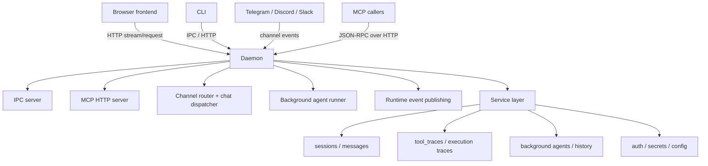
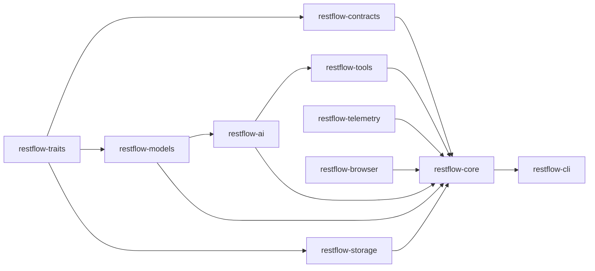
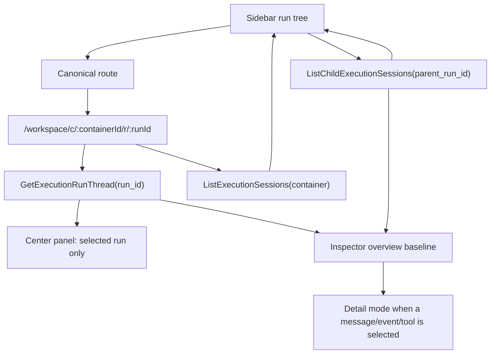
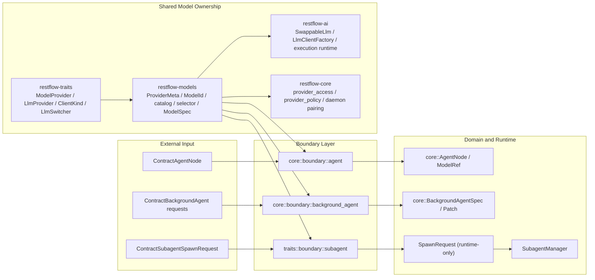

# RestFlow System Architecture

## Status

- Updated: 2026-03-28
- Scope: Runtime architecture, deployment model, and migration baseline
- Audience: Core contributors working on browser, CLI, daemon, and runtime channels

## 1. Architectural Decision

RestFlow follows a **daemon-centric** architecture.

- Daemon is the only execution and persistence owner.
- Browser and CLI are client facades and must call daemon APIs (HTTP/MCP/IPC).
- Business execution happens in core runtime on daemon side.
- Storage writes are centralized in daemon-owned service/storage layers.

This avoids split-brain behavior, inconsistent routing logic, and duplicated write paths.

## 2. System Invariants

1. Single writer: only daemon writes sessions, tool traces, background task state, and bindings.
2. Single execution center: agent execution and routing decisions are daemon-owned.
3. Single event identity: realtime and persisted events must share stable IDs.
4. Client isolation: browser/CLI must not add direct storage business paths.

## 3. Runtime Topology

### 3.1 Runtime Dependency Graph



### 3.2 Crate Dependency Graph



## 4. Main Execution Flows

### 4.1 Chat Session Flow

1. Client sends request to daemon.
2. Daemon routes message via channel runtime.
3. Runtime executes agent/tool loop.
4. Daemon emits realtime events and persists final state.
5. Client renders stream and later reads history from the same source of truth.

### 4.2 Background Agent Flow

1. Task is scheduled/triggered in daemon.
2. Runner executes task in daemon runtime.
3. Messages/events are published once with stable IDs.
4. Task history and message history are persisted by daemon only.

### 4.3 Tool Trace Flow

1. Runtime emits turn/tool events during execution.
2. `tool_traces` persists execution traces.
3. Session execution steps are backfilled from traces for persisted UI rendering.

### 4.4 Browser Workspace Inspection Flow



## 5. Component Responsibilities

### Browser Frontend

- UI state and interaction only.
- Calls daemon through shared HTTP request and stream contracts.
- No local direct storage write path.

### CLI

- Command interface and user-facing formatting.
- Uses daemon as primary runtime endpoint.
- Does not duplicate core runtime behavior.

### Daemon/Core Runtime

- Owns chat routing, background execution, and event emission.
- Owns all persistence updates.
- Owns channel/session binding and policy enforcement.

### Model and Provider Ownership

Provider/model ownership is intentionally split from daemon runtime ownership:

- `restflow-traits` owns canonical provider identity and runtime switching contracts.
- `restflow-models` owns shared provider metadata, model catalog, selectors, and runtime model specs.
- `restflow-ai` owns client construction and hot-swapping mechanics.
- `restflow-core` owns daemon-specific pairing and auth policy.

#### Current Provider and Boundary Map



Operational notes:

- `AgentNode`, `BackgroundAgent`, and `Subagent` ingress now normalize through dedicated boundary modules instead of ad-hoc `serde_json` conversion in services or tool handlers.
- `SpawnRequest` is a runtime-only type. Public subagent ingress must start from `ContractSubagentSpawnRequest` and pass through `traits::boundary::subagent`.
- `ProviderMeta` remains the source of shared provider defaults. `ZaiCodingPlan` currently defaults to `GLM-5.1` in the shared model catalog.

#### Shared Ownership Map

`restflow-traits` owns cross-crate identities and runtime switching contracts:

- `ModelProvider`: canonical provider identity
- `ClientKind`: concrete execution path
- `LlmProvider`: runtime provider bucket used by the LLM factory
- `LlmSwitcher`: runtime model switching interface used by tools and background execution

`restflow-models` owns shared model/provider data and parsing logic:

- `Provider`: API-facing wrapper around `ModelProvider`
- `ProviderMeta`: runtime provider mapping, API key envs, default model, and external aliases
- `ModelId`
- `ModelMetadata` and `ModelMetadataDTO`
- `catalog/`: provider-specific model descriptors and aliases
- `selector.rs`: shared provider selector parsing and model resolution helpers
- `ModelSpec`: runtime model specification consumed by the LLM factory

Current notable provider defaults:

- `MiniMax`: `MiniMax-M2.7`
- `MiniMaxCodingPlan`: `MiniMax-M2.5`
- `Zai`: `GLM-5`
- `ZaiCodingPlan`: `GLM-5.1`

`restflow-ai` owns runtime execution mechanics:

- `SwappableLlm`: active client holder with hot-swap support
- `LlmClientFactory`: concrete client creation
- `LlmSwitcherImpl`: bridge from runtime execution to the shared `LlmSwitcher` trait

`restflow-core` owns daemon-specific policy and pairing logic:

- `ModelRef`: pair/validation wrapper used by daemon-side models
- `auth/provider_access.rs`: availability resolution, credential-driven default model selection, runtime key lookup
- `models/provider_policy.rs`: auth preference ordering
- display-only policy such as provider sort order

#### Concept Boundaries

The following types are intentionally distinct:

- `ModelProvider`: business/provider identity
- `Provider`: transport/API-facing wrapper for `ModelProvider`
- `LlmProvider`: runtime backend bucket used by the LLM factory
- `ClientKind`: concrete execution path

Examples:

- `ClaudeCode` is a canonical provider identity, but its runtime provider bucket is `Anthropic`.
- `Codex` is a canonical provider identity, but its runtime provider bucket is `OpenAI`.
- Two models can share the same `LlmProvider` while using different `ClientKind` values.

#### Runtime Switching Flow

```text
Tool or runtime consumer
  -> LlmSwitcher
      -> provider_for_model(model)
      -> client_kind_for_model(model)
      -> resolve_api_key(provider)
      -> create_and_swap(model, api_key)
          -> LlmClientFactory
          -> SwappableLlm
```

Design intent:

- `LlmSwitcher` is the cross-crate switching contract.
- `SwappableLlm` remains in `restflow-ai` because hot-swapping the active client is a runtime concern, not a catalog concern.

#### Contributor Rules

When adding or changing a provider/model:

1. Add or update the canonical provider in `restflow-traits/src/model.rs`.
2. Update shared provider metadata in `restflow-models/src/provider_meta.rs`.
3. Add or update descriptors and aliases under `restflow-models/src/catalog/`.
4. Update auth policy in `restflow-core` only if authentication behavior changes.
5. Regenerate frontend types if any `#[derive(TS)]` shape changed.

Review guidance:

- If a change adds an alias table to CLI, tool, or agent code, first check whether it belongs in `restflow-models`.
- If a change introduces another provider enum, it is almost certainly the wrong abstraction.
- If a change touches runtime switching, prefer extending `LlmSwitcher` instead of adding a parallel switching trait.

#### Current Non-Goals

These pieces intentionally remain outside the shared model crate:

- auth profile ordering and credential availability logic
- daemon/UI display-only provider ordering
- concrete LLM client implementations and runtime swap mechanics

### Trace Ownership Boundaries

Trace architecture follows the same daemon-centric ownership rules as the rest
of the runtime.

#### Trace Domain Ownership

- `restflow-core` owns trace domain models, typed trace storage wrappers, and
  runtime trace services
- `restflow-storage` owns raw persistence primitives only
- `restflow-ai` owns AI execution stream contracts and execution-domain stream
  types

This means:

- typed trace models belong in `restflow-core`
- raw byte/table persistence stays in `restflow-storage`
- execution streaming abstractions stay near AI execution runtime code

#### What Must Not Move

The following boundaries are intentional and should not be refactored away
without a full dependency review:

1. `StreamEmitter` stays in `restflow-ai`
   - it is coupled to AI execution streaming semantics and AI-specific stream
     payloads
2. Runtime emitter implementations stay in `restflow-core`
   - they depend on storage, sanitization, runtime channels, and daemon-owned
     execution policy
3. Raw trace table definitions stay in `restflow-storage`
   - they are persistence plumbing, not domain APIs

The goal is not to force every trace-related type into one crate. The goal is
to keep protocol, domain, runtime, and storage responsibilities explicit.

### Browser Workspace Execution Architecture

The browser workspace now follows a **run-first inspection model**.

The canonical routes are:

- `/workspace/c/:containerId`
- `/workspace/c/:containerId/r/:runId`

The workspace shell is intentionally split into three roles:

- Left sidebar: run tree navigation
- Center panel: selected run thread only
- Right inspector: selected run overview by default, selected event detail on demand

#### Canonical Data Flows

The browser workspace uses separate daemon read paths for run content and run
relationships.

1. Run content flow:
   - `GetExecutionRunThread { run_id }`
   - Drives the center panel thread and the inspector overview baseline
2. Top-level run flow:
   - `ListExecutionSessions { container }`
   - Returns top-level runs for a container only
3. Child relation flow:
   - `ListChildExecutionSessions { parent_run_id }`
   - Returns direct child runs only

This separation is intentional:

- `GetExecutionRunThread` must describe the body of one run only
- child/subagent relationships must not be embedded into thread content
- left navigation and relationship views must be driven by relation queries

#### Center Panel Rules

The center panel renders only the selected run:

- user-visible messages that belong to the selected run
- timeline events from `ExecutionThread.timeline`
- optimistic/live overlays for the selected run during execution

The center panel must not render:

- child run pseudo-items
- `child_run_link` rows
- sibling or parent run content mixed into the current thread

Parent/child context belongs in navigation and run metadata, not in the body of
the selected run thread.

#### Run Relationship Model

Every run summary used by the workspace must preserve enough identity to resolve
navigation consistently:

- `run_id`
- `container_id`
- `parent_run_id`
- `root_run_id`

The intended interpretation is:

- `container_id`: canonical container used by the route
- `parent_run_id`: direct parent run when the run was spawned by another run
- `root_run_id`: top-level root run in the same execution tree

This allows child runs to behave as first-class runs while still preserving
their lineage.

#### Sidebar Run Tree

The left sidebar is the primary navigation model for execution inspection.

- top-level runs come from `ListExecutionSessions(container)`
- child runs are loaded lazily with `ListChildExecutionSessions(parent_run_id)`
- current run ancestors should auto-expand when needed
- clicking any run, top-level or child, must navigate to the same canonical run
  route shape

The sidebar is responsible for traversal. It is not responsible for composing
thread content across multiple runs.

#### Inspector Modes

The right inspector operates in two modes:

1. Overview mode
   - default state for the active run
   - shows run summary, lineage, child runs, run-scoped telemetry, and related execution metadata
2. Detail mode
   - entered when the user selects a message, event, or tool result
   - shows the detail panel for that selected item

Closing detail must return to overview for the same active run instead of
hiding the inspector entirely.

#### Supporting Interaction Layers

The workspace includes several browser-only interaction layers that sit on top
of the daemon-backed run model:

- `RunOverviewPanel`: run summary and lineage-aware inspector overview
- `ExecutionStatusBar`: active execution state, elapsed time, and current phase
- `CommandPalette`: global browser navigation/action surface for sessions,
  agents, and workspace actions

These layers improve inspection and navigation, but they must not introduce
alternative write paths or alternate execution ownership. Daemon contracts
remain the single source of truth.

## 6. Deployment Model

## Local Development

```bash
restflow daemon start --foreground
```

Common operations:

```bash
restflow daemon start
restflow daemon stop
restflow daemon status
```

MCP HTTP default endpoint:

- `http://localhost:8787/mcp`

### Service Management

- Linux: `systemd` (`scripts/restflow.service`)
- macOS: `launchd` (`scripts/com.restflow.daemon.plist`)

## 7. Data and Config Layout

RestFlow unified runtime directory:

```text
~/.restflow/
├── config.toml
├── restflow.db
├── master.key
└── logs/
```

Supported environment overrides:

- `RESTFLOW_DIR`
- `RESTFLOW_MASTER_KEY`

### 7.1 Effective Config Precedence

Runtime configuration resolves in this order:

1. Code defaults
2. Global `~/.restflow/config.toml`
3. Workspace `./.restflow/config.toml`

Database state is no longer part of the runtime configuration read path. The
database remains the persistence layer for secrets, traces, sessions, and other
runtime state.

### 7.2 Config Groups and Primary Consumers

The `config.toml` file is a unified document with explicit top-level sections.
Runtime configuration now uses the same section names across storage, CLI, and
tooling.

| Group | On-disk shape | Primary purpose | Representative keys | Primary consumers |
| --- | --- | --- | --- | --- |
| System | `[system]` | Cross-cutting system policy, retention, and feature flags | `worker_count`, `task_timeout_seconds`, `max_retries`, `chat_session_retention_days`, `log_file_retention_days` | cleanup services, daemon/runtime setup, feature flag loading |
| Agent | `[agent]` | Agent and sub-agent execution policy | `max_iterations`, `subagent_timeout_secs`, `max_parallel_subagents`, `max_tool_calls`, `tool_timeout_secs` | agent executor, subagent manager, background agent runtime, chat dispatcher |
| API | `[api]` | Default limits for MCP and API-facing operations | `memory_search_limit`, `session_list_limit`, `background_trace_line_limit`, `web_search_num_results` | MCP server handlers, runtime tool registry |
| Runtime | `[runtime]` | Default daemon runtime behavior | `background_runner_poll_interval_ms`, `background_runner_max_concurrent_tasks`, `chat_max_session_history` | background runner, chat dispatcher |
| Channel | `[channel]` | External channel integration defaults | `telegram_api_timeout_secs`, `telegram_polling_timeout_secs` | Telegram channel runtime |
| Registry | `[registry]` | Skill and marketplace integration defaults | `github_cache_ttl_secs`, `marketplace_cache_ttl_secs` | marketplace adapters, skill discovery/install flows |
| CLI | `[cli]` | CLI-only local behavior | `version`, `agent`, `model`, `sandbox.*` | CLI config loader, local sandbox execution |

### 7.3 Naming Principles

Section names describe ownership domains, not implementation details:

- `[system]` replaces ambiguous "root" terminology with an explicit public
  section.
- `_defaults` is not used in on-disk section names. The file stores effective
  runtime configuration, not just suggestion bags.
- CLI convenience selections are flattened into `[cli]` as `agent` and `model`;
  there is no `[cli.default]` subsection anymore.
- Tool-adjacent knobs should live with the subsystem that owns the behavior,
  not in a generic `[tool]` bucket. For example, `web_search_num_results`
  belongs to `[api]`, while channel transport timeouts belong to `[channel]`.

## 8. Migration Baseline

Automatic migrations are expected for legacy key/profile formats. Runtime
configuration now converges into `~/.restflow/config.toml`.

## 9. Compatibility and Validation Baseline

Compatibility remains part of the architecture, not an optional release task.

### Compatibility Principles

1. CLI command paths, MCP tool names, and daemon HTTP request/stream envelopes
   must remain stable unless a change is explicitly versioned.
2. Public evolution must be additive-first:
   - add optional fields before removing old ones
   - keep tolerant readers while migrations are still in flight
   - preserve old aliases until rollout is complete
3. Browser, CLI, and MCP remain facades over daemon-owned behavior. New client
   features must not create alternate write paths.

### Validation Gates

All architecture-sensitive changes should satisfy these blocking checks before
merge:

- Backend:
  - `cargo fmt --all -- --check`
  - `cargo clippy --all-targets --all-features -- -D warnings`
  - `cargo test --workspace`
- Frontend:
  - `cd web && npm run test`
  - `cd web && npm run build`
- End-to-end:
  - `cd e2e-tests && npm test`

### Required Smoke Flows

After architecture-sensitive changes, verify at least these flows:

1. Daemon lifecycle:
   - start
   - health/status check
   - clean stop
2. Chat execution:
   - request
   - stream
   - persisted history replay
3. Background execution:
   - trigger
   - observe progress
   - read persisted history
4. Workspace inspection:
   - top-level run navigation
   - child run navigation
   - inspector overview/detail transitions

## 10. Guardrails for Contributors

Do:

- Add new business capabilities in daemon IPC/RPC handlers first.
- Keep routing ownership in daemon runtime components.
- Preserve one-way client facade boundaries.

Do not:

- Add direct storage access in browser adapters or request handlers.
- Add fallback write paths that bypass daemon ownership.
- Encode routing ownership only in display fields on session models.

## 11. Implementation Roadmap (High-Level)

1. Enforce daemon handshake and remove silent fallback execution paths.
2. Unify client command surfaces through daemon APIs.
3. Move routing ownership to explicit channel/session binding.
4. Unify realtime and persisted event identity to eliminate duplicates.
5. Remove obsolete compatibility paths after rollout verification.
