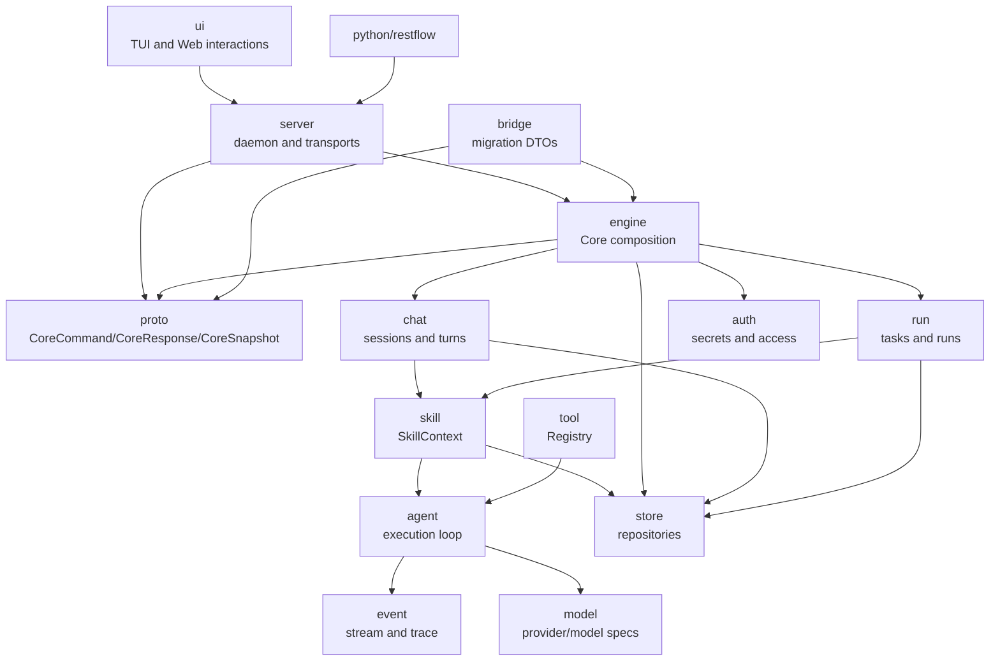

# V2 Architecture

## Target Shape

```text
Product shell
  CLI / TUI / Web / daemon / MCP / packages

Core modules
  proto / server / engine / bridge / agent / skill / tool / run / chat / store / model / auth / event

Python package
  restflow.agent / restflow.skill / restflow.tool / ...
```

## Boundary Diagram



## Ownership

### agent

Owns the execution loop, prompt assembly, tool-call orchestration, context
management, cancellation, and subagent execution.

### skill

Owns skill metadata, catalogs, mention parsing as text semantics, assigned skill
summaries, mentioned skill content, repository-backed catalog loading, and
AI-facing context resolution.

### tool

Owns the `Tool` trait, registry, schema metadata, and pure tool execution
contracts.

### run

Owns durable task/run execution concepts, checkpoints, run status, and run
artifacts.

### chat

Owns sessions, messages, turns, and stream-to-history finalization.

### store

Owns backend-neutral repository traits and backend capability contracts.

### proto

Owns stable command, response, and snapshot protocol types shared across Rust
modules, server transports, and Python bindings. It depends only on domain value
crates and must not execute commands or own transport details.

### engine

Owns core composition, in-memory/default store wiring, command execution,
snapshot import/export, and the `CoreCommand` to `CoreResponse` runtime
boundary. It may coordinate `chat`, `run`, `skill`, `tool`, `auth`, and
`store`, but it must not own product transport details.

### bridge

Owns migration DTOs and one-way import helpers for moving legacy boundary data
into V2. It is not a product runtime path and should stay separate from the
`server` command ingress.

### server

Owns the product ingress boundary. CLI, TUI, Web, MCP, and Python adapters should
submit `CoreCommand` values or tagged command JSON and receive `CoreResponse`
values or tagged response JSON. Product shells should not reach into `agent`,
`chat`, `run`, or `skill` internals directly.

### model

Owns provider/model identity, catalog, selectors, and runtime model specs.

### auth

Owns secret references, auth profiles, provider access, and credential
resolution policy.

### event

Owns event types shared by agent, chat, run, server, and Python bindings.

## @skill Boundary

`@skill` has two separate layers:

- UI layer: opens a picker and inserts plain text such as `@team`.
- Runtime layer: parses final message text and builds a `SkillContext`.

The UI never grants tools. The skill module does not decide tool permissions.
The runtime never knows how the mention was typed.
