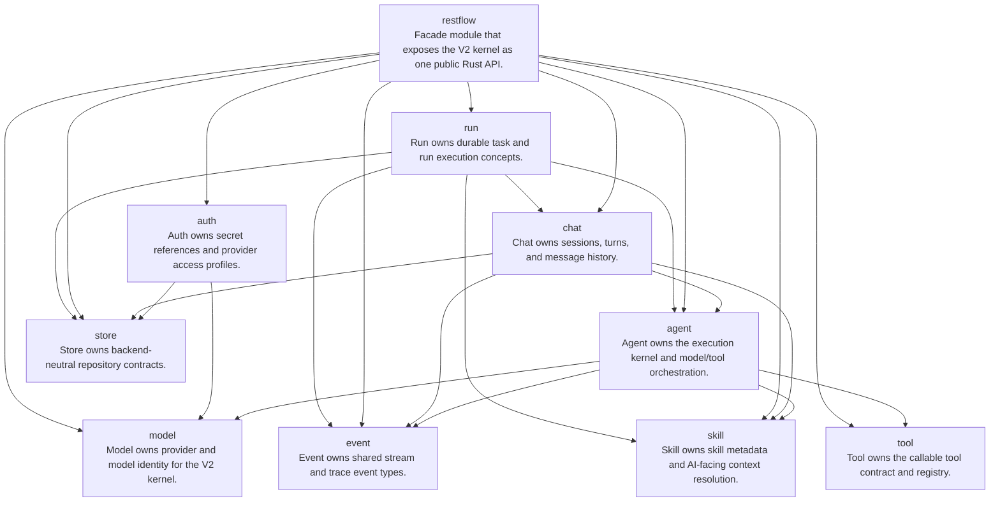

# CODOCIA

Generated by Codocia from `# codocia` Markdown blocks.

## Module Graph

## Modules

- [`agent`](./agent.md): Agent owns the execution kernel and model/tool orchestration.
- [`auth`](./auth.md): Auth owns secret references and provider access profiles.
- [`chat`](./chat.md): Chat owns sessions, turns, and message history.
- [`event`](./event.md): Event owns shared stream and trace event types.
- [`model`](./model.md): Model owns provider and model identity for the V2 kernel.
- [`restflow`](./restflow.md): Facade module that exposes the V2 kernel as one public Rust API.
- [`run`](./run.md): Run owns durable task and run execution concepts.
- [`skill`](./skill.md): Skill owns skill metadata and AI-facing context resolution.
- [`store`](./store.md): Store owns backend-neutral repository contracts.
- [`tool`](./tool.md): Tool owns the callable tool contract and registry.
